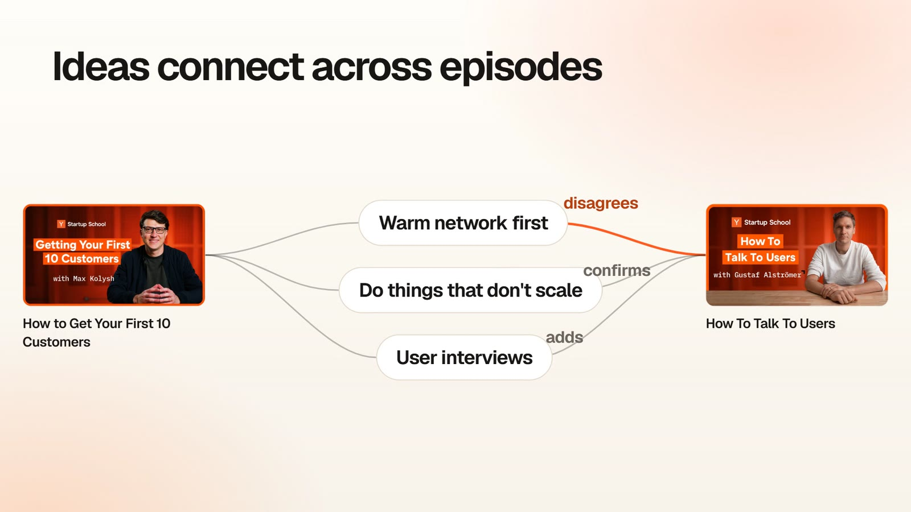
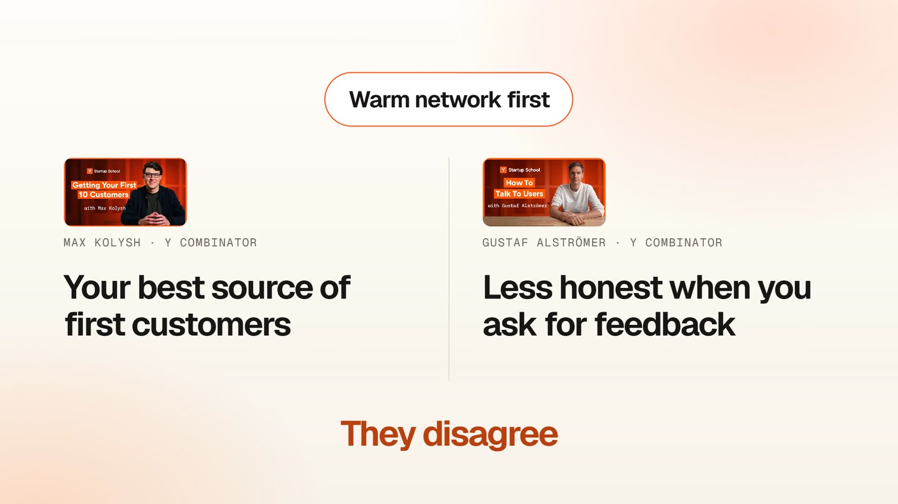
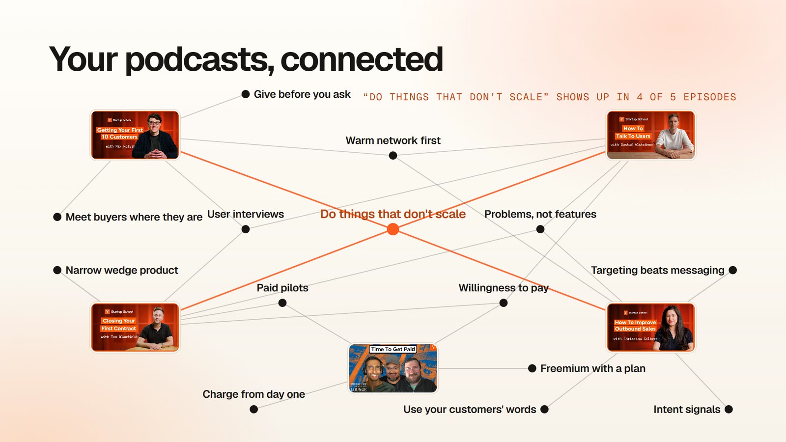
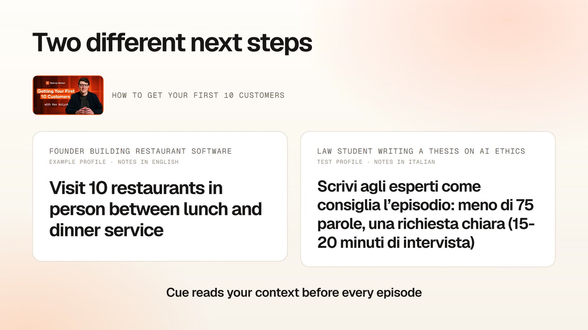
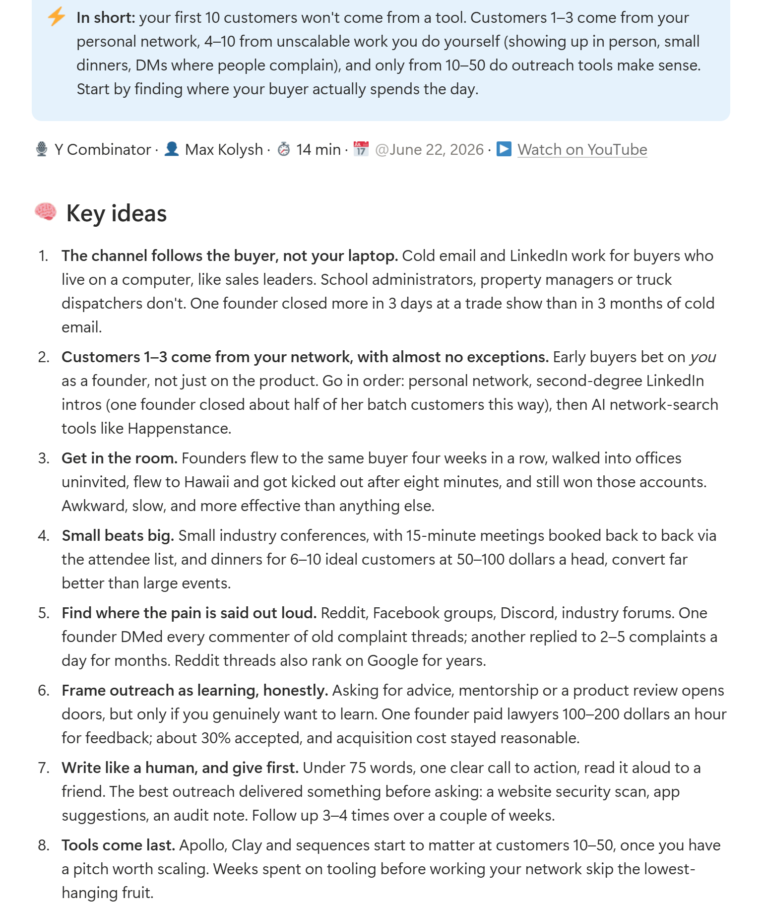
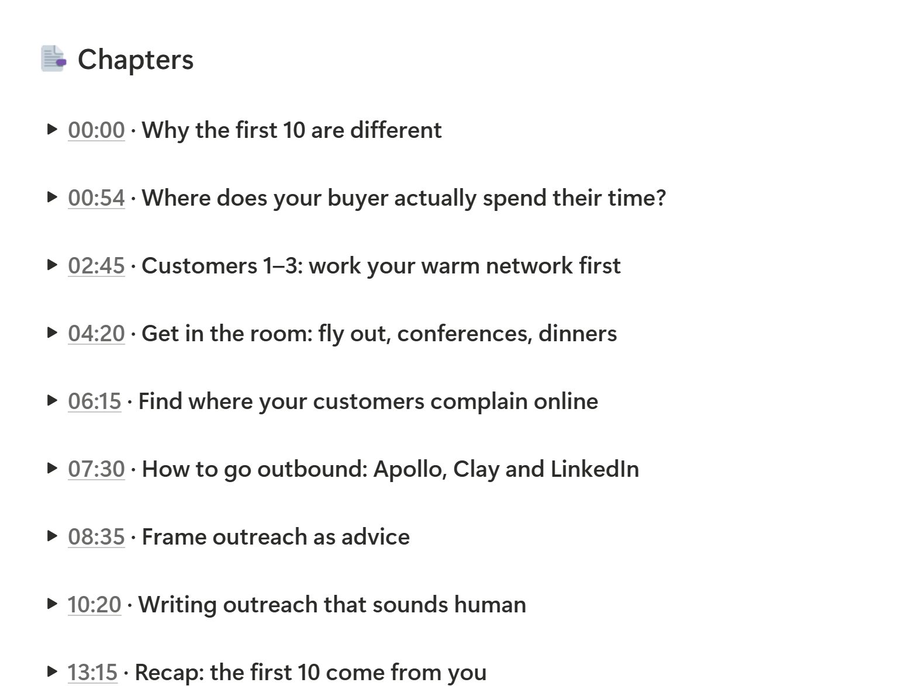

<p>
  <picture>
    <source media="(prefers-color-scheme: dark)" srcset="docs/images/cue-logo-reversed.svg">
    
  </picture>
</p>

# cue

**Podcast e video che ricordi davvero, e cosa significano per te.**

Incolli il link di un podcast, di un video YouTube, di un talk o di una lezione. Ottieni cosa dice, cosa significa *per te* e cosa fare, nel tuo Notion. *(Cue si pronuncia come la lettera Q.)*

[🇬🇧 Read in English](README.md)

Ascolti podcast bellissimi, guardi talk e lezioni, e dopo una settimana non ricordi niente. Cue trasforma ognuno in una pagina Notion che userai davvero. Dentro trovi:
- le idee chiave;
- i capitoli con i minutaggi cliccabili;
- le citazioni migliori;
- la parte che conta: **come si collega ai tuoi progetti e cosa dovresti farne**.

È un plugin gratuito per l'app Claude. Niente chiavi API, niente abbonamenti oltre al tuo piano Claude, niente codice.

## L'idea in 30 secondi

https://github.com/user-attachments/assets/e10e5245-765c-46e8-b7ea-6ad10795b196

<table>
  <tr>
    <td width="50%"><br><sub>Ogni puntata diventa idee, e le idee si collegano tra puntate diverse</sub></td>
    <td width="50%"><br><sub>Cue nota quando due ospiti non sono d'accordo</sub></td>
  </tr>
  <tr>
    <td width="50%"><br><sub>Col tempo podcast e video diventano un unico cervello collegato</sub></td>
    <td width="50%"><br><sub>Stessa puntata, due persone: Cue legge il tuo contesto e dà a ognuno un passo diverso</sub></td>
  </tr>
</table>

## Guardalo in azione

Sono pagine vere create da Cue, non bozze grafiche. **[Sfoglia la demo →](https://app.notion.com/p/nikolaj1205/cue-demo-3e74ef8c88ab81df84e6fb5c93256e8b)** Senza installare niente: cinque puntate di Y Combinator elaborate da Cue per un founder di esempio che costruisce un'app per i turni dei ristoranti (demo in inglese).

<table>
  <tr>
    <td width="50%"><br><sub>In breve e idee chiave, con i numeri veri della puntata</sub></td>
    <td width="50%"><br><sub>Cosa significa per me: legato alle domande del founder</sub></td>
  </tr>
  <tr>
    <td width="50%"><br><sub>Capitoli con i minuti cliccabili</sub></td>
    <td width="50%"><br><sub>Un concetto su cui due ospiti non sono d'accordo</sub></td>
  </tr>
</table>

## Perché si chiama così

Nell'audio il **cue point** è il punto preciso di una traccia da cui ripartire: ogni nota di Cue ne ha uno. In psicologia il **retrieval cue** è lo spunto che fa tornare in mente un ricordo: è la promessa.

## Cosa ottieni

Per ogni puntata, una pagina Notion con:

- ⚡ **In breve:** l'idea centrale in 2-3 frasi.
- 🧠 **Idee chiave:** 5-8 punti con i numeri e gli esempi veri della puntata.
- 📑 **Capitoli:** con i minutaggi che portano dritti a quel momento.
- 💬 **Citazioni:** parola per parola, con il minuto.
- 🧭 **Cosa significa per me:** legato ai *tuoi* progetti e obiettivi, non consigli generici.
- 🔗 **Collegamenti:** i concetti della puntata e cosa ne dicono le altre puntate che hai già elaborato: chi è d'accordo e chi no.
- ✅ **Azioni:** passi concreti (un libro, un tool da provare, un'idea per il tuo progetto) raccolti in un'unica lista.

Col tempo costruisci un **cervello**: una libreria di concetti che collega le puntate tra loro. Aprendo "effetti di rete" o "pricing" vedi tutto quello che ne ha detto ogni ospite.

I riassunti sono nella lingua che scegli. Le citazioni restano in lingua originale.

## Cosa ti serve

- L'**app Claude** per computer (Windows o Mac) con un piano Claude **Pro o Max**.
- Un account **Notion** collegato a Claude (Impostazioni → Connettori → Notion).
- Circa 5 minuti.

## Installazione

Nell'app Claude per computer apri la scheda **Code** e avvia una sessione in una cartella qualsiasi (per esempio *Documenti*). Poi:

1. Clicca **+** accanto alla casella del messaggio → **Plugins** → **Add plugin**.
2. Scegli **Add marketplace** e incolla:
   ```
   https://github.com/NikolajSaudella/cue
   ```
3. Seleziona **cue** nella lista e scegli **Install for you**, così funziona in ogni cartella.

<details>
<summary>Usi Claude Code dal terminale?</summary>

```
/plugin marketplace add NikolajSaudella/cue
/plugin install cue@cue
```
</details>

Poi apri una nuova chat e scrivi:

```
Configura Cue
```

Da lì fa tutto Claude:
1. **Ti fa 4 domande veloci:** chi sei, cosa stai costruendo, i tuoi obiettivi e i temi che ti interessano. È quello che rende gli appunti personali.
2. **Crea il tuo spazio cue su Notion:** una pagina principale, la pagina con il tuo contesto e i database Puntate, Concetti e Azioni (i nomi sono in inglese).
3. **Installa gli strumenti di trascrizione** sul tuo computer. Tu approvi e basta: niente terminale.
4. **Elabora con te la prima puntata.**

## Uso quotidiano

- **Incolla un link** in Claude: un podcast (Spotify, Apple Podcasts), qualsiasi video YouTube (interviste, talk, lezioni, webinar) o il link di un file audio.
- **Dal telefono:** aggiungi una riga con il link nell'**📥 Inbox** di Notion, poi di' a Claude "processa la mia inbox".
- **Tieni aggiornata "🧭 My context":** nuovo progetto, nuovo obiettivo? Modifica la pagina e le prossime puntate ne terranno conto.

Tempi:
- **Puntate YouTube con sottotitoli:** un paio di minuti.
- **Puntate da trascrivere** (Spotify, Apple Podcasts, YouTube senza sottotitoli): circa 30-45 minuti per ogni ora di audio su un portatile normale, meno sui computer recenti. Lavora in background: puoi fare altro, ma il computer deve restare acceso.

## Come funziona

- **La trascrizione avviene sul tuo computer.** Usa i sottotitoli di YouTube se ci sono; altrimenti Whisper, il modello open source di riconoscimento vocale.
- **Le puntate Spotify** vengono abbinate alla stessa puntata pubblica su Apple Podcasts o nel suo feed RSS. Le esclusive Spotify non si possono trascrivere: usa il link YouTube, se esiste.
- **Claude**, nella tua app e con il tuo piano, scrive gli appunti e parla con Notion tramite il connettore ufficiale.

Più dettagli (in inglese): [docs/how-it-works.md](docs/how-it-works.md).

## Privacy

- Audio e trascrizioni restano **sul tuo computer**.
- Gli appunti vanno solo nel **tuo** Notion, tramite il connettore che hai autorizzato.
- Cue non ha server, account né statistiche.

## Domande frequenti

**Costa qualcosa?**
No. Usa il tuo piano Claude e strumenti gratuiti e open source.

**Il computer deve restare acceso?**
Sì, mentre una puntata viene elaborata, perché la trascrizione gira in locale.

**Posso cambiare l'aspetto su Notion?**
Puoi aggiungere viste, spostare pagine e aggiungere proprietà tue. Non rinominare le proprietà esistenti né le loro opzioni: Cue usa quei nomi.

## Prossime funzioni

- 📡 **Iscrizioni:** segui un podcast o un canale YouTube e le puntate nuove arrivano da sole.
- 📬 **Digest della settimana:** ogni domenica le idee che sono tornate e 3 azioni.
- ⏰ **Automazioni:** l'inbox elaborata a orari fissi.
- 🤝 **Altre app di AI** (ChatGPT / Codex): oggi Cue funziona nell'app Claude. Se lo useresti altrove, scrivilo nelle [Issues](../../issues).

## Crediti

Creato da [Nikolaj Saudella](https://www.linkedin.com/in/nikolajsaudella/): io ho fatto il product owner, [Claude Code](https://claude.com/claude-code) l'ingegnere.
Licenza MIT.
