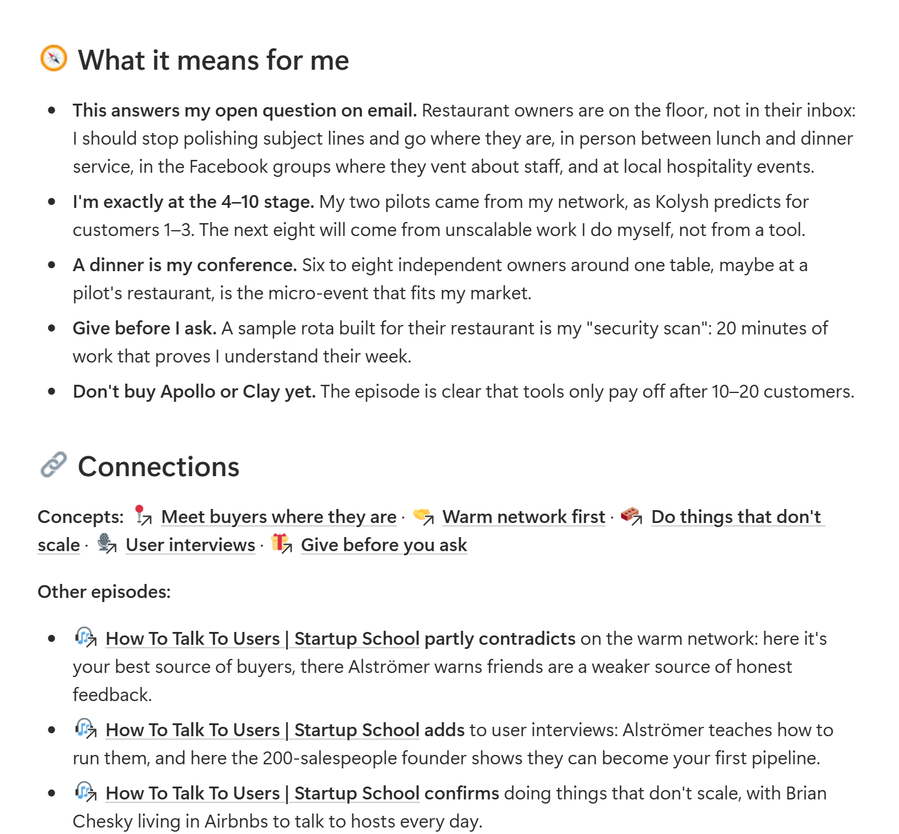
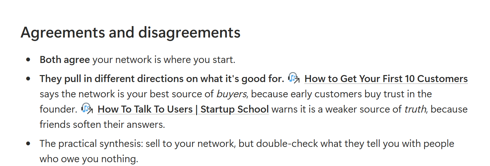

<p>
  <picture>
    <source media="(prefers-color-scheme: dark)" srcset="docs/images/cue-logo-reversed.svg">
    
  </picture>
</p>

# cue

[](https://code.claude.com/docs/en/plugins) [](LICENSE) [](https://github.com/NikolajSaudella/cue/releases)

**Podcast e video che ricordi davvero, e cosa significano per te.**

Incolli il link di un podcast, di un talk su YouTube o di una lezione. Cue scrive una pagina nel tuo Notion con cosa dice, cosa significa *per te* e cosa fare, e la collega a tutto quello che hai già ascoltato. Un plugin gratuito per l'app Claude.

*Perché "cue"? Il cue point è il punto preciso di una traccia da cui ripartire; il retrieval cue è lo spunto che fa tornare in mente un ricordo. Si pronuncia come la lettera Q.*

[🇬🇧 Read in English](README.md)


▶ [Guarda il video di 30 secondi](https://github.com/user-attachments/assets/0a614909-6b1b-490a-965a-43da737f889c)

## Prova la demo

**[Sfoglia la demo →](https://app.notion.com/p/nikolaj1205/cue-demo-3e74ef8c88ab81df84e6fb5c93256e8b)** Pagine vere create da Cue da cinque puntate di Y Combinator, per un founder di esempio (demo in inglese). Senza installare niente.

<table>
  <tr>
    <td width="50%"><br><sub>Cosa significa per me: legato ai tuoi progetti</sub></td>
    <td width="50%"><br><sub>Collegamenti: dove gli ospiti sono d'accordo o no</sub></td>
  </tr>
</table>

## Cosa ottieni

- 🧠 **Le idee chiave**, con i numeri e gli esempi veri, e i capitoli con i minuti cliccabili
- 💬 **Le citazioni**, parola per parola, con il minuto
- 🧭 **Cosa significa per te**: legato ai tuoi progetti e obiettivi, non consigli generici
- 🔗 **Un cervello che cresce**: le idee si collegano tra tutto quello che hai elaborato, anche quando gli ospiti non sono d'accordo
- ✅ **Azioni**: passi concreti, raccolti in un'unica lista

Note nella lingua che scegli. Audio e trascrizioni restano sul tuo computer.

## Installazione

Ti serve l'**app Claude** per computer (Windows o Mac) con piano **Pro o Max**, e **Notion** collegato a Claude (Impostazioni → Connettori → Notion).

1. Nell'app Claude apri la scheda **Code** e avvia una sessione in una cartella qualsiasi.
2. Clicca **+** → **Plugins** → **Add plugin** → **Add marketplace** e incolla `https://github.com/NikolajSaudella/cue`
3. Seleziona **cue** → **Install for you**. Poi apri una nuova chat e scrivi **Configura Cue**.

Claude ti fa qualche domanda veloce (quasi tutte con un clic, e basta il link al tuo sito), ti mostra cosa ha capito, crea il tuo spazio su Notion, installa quello che serve (tu approvi e basta) ed elabora una prima puntata scelta sulla domanda a cui stai lavorando. Circa 5 minuti.

<details>
<summary>Usi Claude Code dal terminale?</summary>

```
/plugin marketplace add NikolajSaudella/cue
/plugin install cue@cue
```
</details>

## Come si usa

- **Incolla un link** in Claude: Spotify, Apple Podcasts, qualsiasi video YouTube o un file audio.
- **Dal telefono**: aggiungi il link nell'📥 Inbox di Notion, poi di' a Claude "elabora la mia inbox".
- **Tieni aggiornata "🧭 My context"**: è quello che rende le note su di te.

## Domande frequenti

**Costa qualcosa?** No. Usa il tuo piano Claude e strumenti gratuiti e open source.

**Dove finiscono i miei dati?** Audio e trascrizioni restano sul tuo computer, le note vanno solo nel tuo Notion. Cue non ha server né statistiche.

**È sicuro?** Il codice è aperto, chiunque può leggerlo. Cue esegue solo i suoi programmi di trascrizione, installa Python con l'installer ufficiale di uv dopo avertelo chiesto, e scrive solo nelle sue pagine Notion e nella sua cartella sul tuo computer. Non chiede mai password né chiavi API.

**Quanto ci mette?** Un paio di minuti per i video YouTube con sottotitoli. L'audio da trascrivere richiede circa 30-45 minuti per ogni ora su un portatile normale, in background.

**Come lo aggiorno?** Nell'app Claude: **+** → **Plugins** → **Manage plugins** → **cue** → **Update** (o **Aggiorna**). Per sapere quando esce una nuova versione, clicca **Watch** → **Custom** → **Releases** in cima a questa pagina.

**Come lo tolgo?** **+** → **Plugins** → **Manage plugins** → **cue** → **Uninstall**. Le pagine Notion restano tue; la cartella di Cue sul tuo computer (trascrizioni e modello vocale) se ne va con lui.

Altre domande e come funziona sotto il cofano (in inglese): [docs/how-it-works.md](docs/how-it-works.md).

---

**Prossimi passi:** iscrizioni ai tuoi programmi preferiti, un digest settimanale, elaborazioni automatiche e forse altre app di AI (ChatGPT / Codex). Idee e bug: [Issues](../../issues).

Se Cue ti è utile, una ⭐ su GitHub aiuta altri a trovarlo.

Creato in meno di 48 ore da [Nikolaj Saudella](https://www.linkedin.com/in/nikolajsaudella/): io ho fatto il product owner, [Claude Code](https://claude.com/claude-code) l'ingegnere. Licenza MIT.
