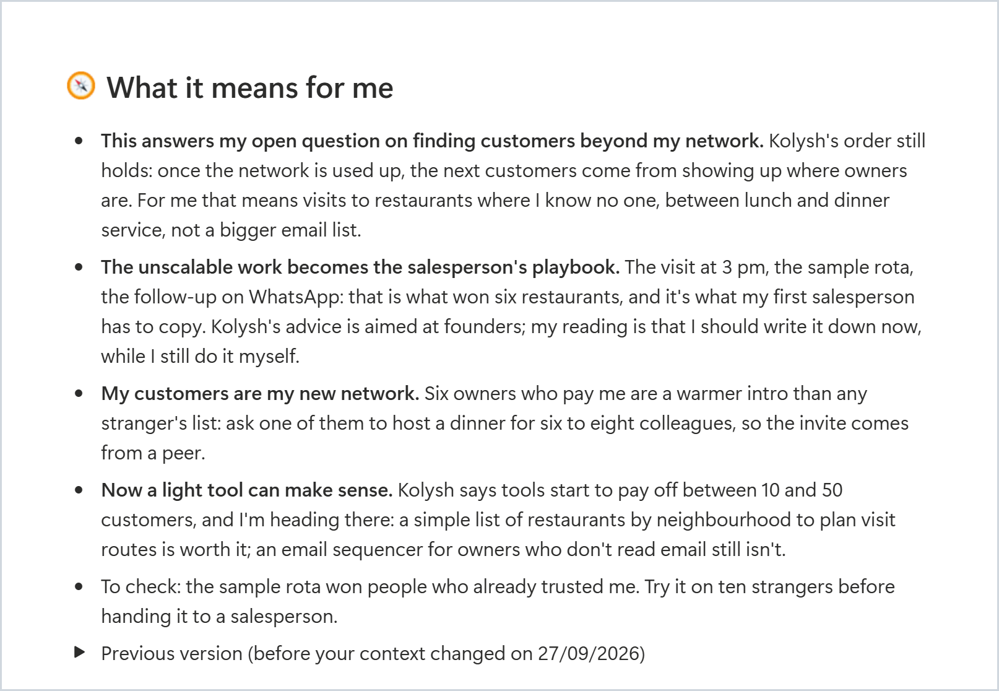

<p align="center">
  <picture>
    <source media="(prefers-color-scheme: dark)" srcset="docs/images/cue-logo-reversed.svg">
    
  </picture>
</p>

<h3 align="center">Podcasts and videos you actually remember — and what they mean for you.</h3>

<p align="center">Paste a link to a podcast, a YouTube talk or a lecture. Cue writes a page in your Notion with what it says, what it means for <i>you</i> and what to do next, connected to everything you've heard before. When your work or goals change, your past notes update with you. A free, open-source plugin for the Claude app (needs a Claude Pro or Max plan).</p>

<p align="center"><b><a href="https://github.com/user-attachments/assets/0a614909-6b1b-490a-965a-43da737f889c">▶ Watch the 30-second video</a> · <a href="https://app.notion.com/p/nikolaj1205/cue-demo-3e74ef8c88ab81df84e6fb5c93256e8b">Explore the live demo</a> · <a href="#install">Install</a> · <a href="README.it.md">🇮🇹 Italiano</a></b></p>

<p align="center"><a href="https://code.claude.com/docs/en/plugins"></a> <a href="LICENSE"></a> <a href="https://github.com/NikolajSaudella/cue/releases"></a> <a href="https://github.com/NikolajSaudella/cue/actions/workflows/check.yml"></a></p>

<a href="https://github.com/user-attachments/assets/0a614909-6b1b-490a-965a-43da737f889c"></a>

<p align="center"><sub><i>Why "cue"? A cue point is the exact spot in a track you jump back to; a retrieval cue is the hint that brings a memory back. Pronounced like the letter Q.</i></sub></p>

## See the difference

Real pages from the [live demo](https://app.notion.com/p/nikolaj1205/cue-demo-3e74ef8c88ab81df84e6fb5c93256e8b): five Y Combinator videos, processed for an example founder building restaurant software.

**Not just a summary. Advice for your project, and it follows you.** A talk on getting your first 10 customers becomes next steps for *this* founder. When the founder's situation changed (6 paying restaurants, a first salesperson to hire), cue rewrote the advice and kept the old version one click away. [Open the episode →](https://app.notion.com/p/nikolaj1205/3e74ef8c88ab81778145e4edf8d00a5d)

<a href="https://app.notion.com/p/nikolaj1205/3e74ef8c88ab81778145e4edf8d00a5d"></a>

**When two episodes pull in different directions.** One guest says your network is your best source of buyers, another warns it's a weaker source of truth: cue puts them side by side. [Open the idea →](https://app.notion.com/p/nikolaj1205/3e74ef8c88ab8191a943ddd104cd34a2)

<a href="https://app.notion.com/p/nikolaj1205/3e74ef8c88ab8191a943ddd104cd34a2"></a>

**One idea. Four episodes.** "Do things that don't scale" comes back in four different videos, and the idea keeps what each guest said. [Open the idea →](https://app.notion.com/p/nikolaj1205/3e74ef8c88ab811583d1d54e1713e67d)

<a href="https://app.notion.com/p/nikolaj1205/3e74ef8c88ab811583d1d54e1713e67d"></a>

## What you get

- 🧠 **The key ideas**, with the real numbers and examples, and chapters with clickable timestamps
- 💬 **Quotes**, word for word, with the minute they were said
- 🧭 **What it means for you**: linked to your projects and goals, not generic advice
- 🔗 **A brain that grows**: ideas connect across everything you've processed, including where guests disagree
- ✅ **Actions**: concrete next steps, collected in one to-do list

Notes in the language you choose. Audio and transcripts are saved only on your computer.

## Install

You need the **[Claude desktop app](https://claude.ai/download)** (Windows or Mac) with a **Pro or Max** plan, and a **Notion** account (the free plan is fine). Cue works in the app's **Code** tab, not in the normal chat: only Code can run the transcription on your computer.

1. **Open the Code tab.** In the Claude app, click **Code** at the top. When it asks for a folder, pick any one (your Documents folder is fine: cue doesn't touch it).
2. **Connect Notion.** Click **+** next to the message box → **Connectors** → **Notion** → **Connect**, sign in and allow access to your workspace. If Notion is already connected, just check that it's switched on there.
3. **Add cue.** Click **+** → **Plugins** → **Add plugin** → **Add marketplace**, paste `https://github.com/NikolajSaudella/cue`, then select **cue** → **Install for you**.
4. **Start.** Open a new session in the Code tab and write **Set up Cue**.

Claude asks a few quick questions (most are one tap, and a link to your website is enough), shows you what it understood, creates your space in Notion, installs everything it needs (you just approve) and processes a first episode picked for the question you're working on. About 5 minutes.

<details>
<summary>Using Claude Code in the terminal?</summary>

```
/plugin marketplace add NikolajSaudella/cue
/plugin install cue@cue
```

For Notion, use the connector of your claude.ai account (sign in with the same account), or add Notion's server with `claude mcp add --transport http notion https://mcp.notion.com/mcp` and sign in with `/mcp`.
</details>

## Use it

- **Paste a link** in Claude: Spotify, Apple Podcasts, any YouTube video, or an audio file.
- **On your phone**: add the link to the 📥 Inbox in Notion, then tell Claude "process my inbox".
- **Keep "🧭 My context" up to date**: it's what makes the notes about you. Changed job or project? Say **"refresh my notes"** and cue rewrites "What it means for me" on your past episodes (the old version stays in a toggle).

## FAQ

<details>
<summary><b>Does it cost anything?</b></summary>

The plugin is free and open source. You need a **Claude Pro or Max** plan, because cue runs in Claude's Code tab; the transcription tools it uses are free too.

</details>

<details>
<summary><b>Can I use it in the normal Claude chat?</b></summary>

No, it runs in the **Code** tab of the Claude app, because it transcribes on your computer. Same app, same plan, nothing extra to pay.

</details>

<details>
<summary><b>How long does it take?</b></summary>

- **YouTube with captions:** a few minutes in all.
- **Audio to transcribe** (Spotify, Apple Podcasts, videos without captions): about **15-25 minutes per hour of audio**, in the background.
- It depends mostly on your processor and how busy it is. The very first time, cue also downloads a ~500 MB speech model.

</details>

<details>
<summary><b>Which computers does it work on?</b></summary>

Windows and Mac, with the Claude desktop app. Tested on Windows 11 so far: if you try it on a Mac, tell us how it went in the [Issues](../../issues).

</details>

<details>
<summary><b>Where does my data go?</b></summary>

**What cue keeps:**
- **Your computer:** the transcripts (the audio is deleted once transcribed).
- **Your Notion:** the notes, never the full transcript.

**Who it talks to:**
- **Claude** reads the transcript to write your notes, under your Claude plan's terms.
- **The episode's own site** (YouTube, the podcast host, Spotify's public page) to download captions or audio, and Apple's public podcast search to find a Spotify episode's feed.
- **Hugging Face**, once, to download the speech model; **GitHub**, twice a day, to check for a new version of cue. Nothing about you or your episodes is sent.

Cue itself has no server, no account and no analytics.

</details>

<details>
<summary><b>Is it safe?</b></summary>

The code is open for anyone to read. Cue only runs its own transcription scripts, writes only to its own Notion pages and its own folder, and never asks for passwords or API keys. It installs Python (through the official uv installer) only after asking you.

</details>

<details>
<summary><b>How do I update or remove it?</b></summary>

In the Claude app: **+** → **Plugins** → **Manage plugins** → **cue** → **Update** or **Uninstall**.

Uninstalling keeps your Notion pages. To hear about new versions, click **Watch** → **Custom** → **Releases** at the top of this page.

</details>

<details>
<summary><b>Something's not working?</b></summary>

- **"Notion isn't connected":** in the Code tab, **+** → **Connectors** → switch Notion on, then start a new session.
- **Too many permission requests:** cue's commands are pre-approved; for Notion, choose "Always allow" the first time.
- **A YouTube video fails:** cue updates its downloader and retries by itself. Private, age-restricted or members-only videos can't be read.
- **Transcription is slow:** the Progress column in Notion shows the minutes left. Video calls and exports slow it down.
- **Still stuck?** Tell Claude what happened in your own words, or open an [issue](../../issues).

</details>

More questions, and how it works under the hood: [docs/how-it-works.md](docs/how-it-works.md).

---

<p align="center"><b>Coming next:</b> ask questions across everything you've heard, subscriptions to your favourite shows, a weekly digest.<br>Ideas and bugs: <a href="../../issues">Issues</a> · Want to help? <a href="CONTRIBUTING.md">CONTRIBUTING.md</a> · If cue helps you, a ⭐ helps others find it.</p>

<p align="center"><sub>Built in under 48 hours by <a href="https://www.linkedin.com/in/nikolajsaudella/">Nikolaj Saudella</a>: I was the product owner, <a href="https://claude.com/claude-code">Claude Code</a> was the engineer. MIT License.</sub></p>
