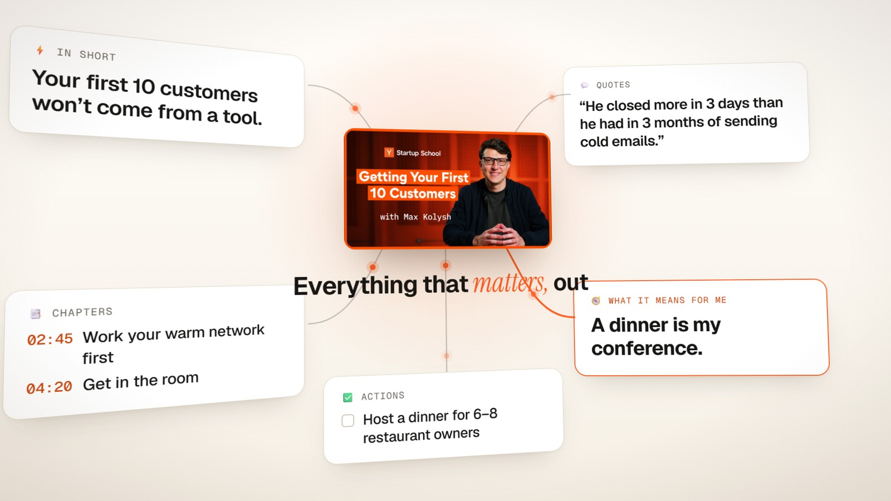
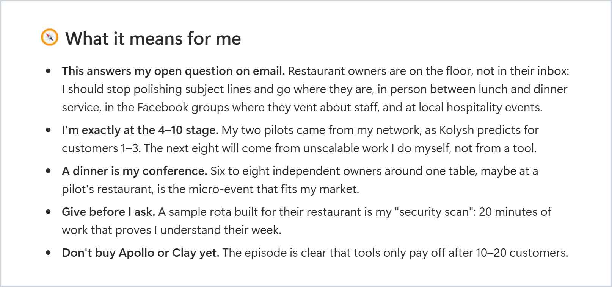
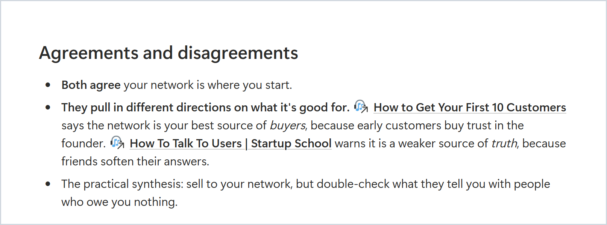
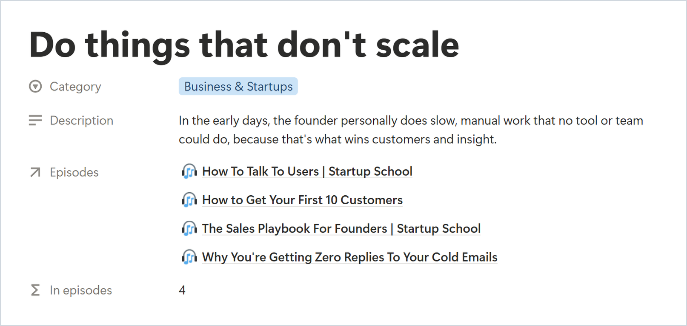

<p align="center">
  <picture>
    <source media="(prefers-color-scheme: dark)" srcset="docs/images/cue-logo-reversed.svg">
    
  </picture>
</p>

<h3 align="center">Podcasts and videos you actually remember — and what they mean for you.</h3>

<p align="center">Paste a link to a podcast, a YouTube talk or a lecture. Cue writes a page in your Notion with what it says, what it means for <i>you</i> and what to do next, connected to everything you've heard before. A free plugin for the Claude app.</p>

<p align="center"><b><a href="https://github.com/user-attachments/assets/0a614909-6b1b-490a-965a-43da737f889c">▶ Watch the 30-second video</a> · <a href="https://app.notion.com/p/nikolaj1205/cue-demo-3e74ef8c88ab81df84e6fb5c93256e8b">Explore the live demo</a> · <a href="#install">Install</a> · <a href="README.it.md">🇮🇹 Italiano</a></b></p>

<p align="center"><a href="https://code.claude.com/docs/en/plugins"></a> <a href="LICENSE"></a> <a href="https://github.com/NikolajSaudella/cue/releases"></a> <a href="https://github.com/NikolajSaudella/cue/actions/workflows/check.yml"></a></p>

<a href="https://github.com/user-attachments/assets/0a614909-6b1b-490a-965a-43da737f889c"></a>

<p align="center"><sub><i>Why "cue"? A cue point is the exact spot in a track you jump back to; a retrieval cue is the hint that brings a memory back. Pronounced like the letter Q.</i></sub></p>

## See the difference

Real pages from the [live demo](https://app.notion.com/p/nikolaj1205/cue-demo-3e74ef8c88ab81df84e6fb5c93256e8b): five Y Combinator videos, processed for an example founder building restaurant software.

**Not just a summary. Advice for your project.** A talk on getting your first 10 customers becomes next steps for *this* founder. [Open the episode →](https://app.notion.com/p/nikolaj1205/3e74ef8c88ab81778145e4edf8d00a5d)

<a href="https://app.notion.com/p/nikolaj1205/3e74ef8c88ab81778145e4edf8d00a5d"></a>

**When two episodes pull in different directions.** One guest says your network is your best source of buyers, another warns it's a weaker source of truth: cue puts them side by side. [Open the idea →](https://app.notion.com/p/nikolaj1205/3e74ef8c88ab8191a943ddd104cd34a2)

<a href="https://app.notion.com/p/nikolaj1205/3e74ef8c88ab8191a943ddd104cd34a2"></a>

**One idea. Four episodes.** "Do things that don't scale" comes back in four different videos, and the idea keeps what each guest said. [Open the idea →](https://app.notion.com/p/nikolaj1205/3e74ef8c88ab811583d1d54e1713e67d)

<a href="https://app.notion.com/p/nikolaj1205/3e74ef8c88ab811583d1d54e1713e67d"></a>

## What you get

- 🧠 **The key ideas**, with the real numbers and examples, and chapters with clickable timestamps
- 💬 **Quotes**, word for word, with the minute they were said
- 🧭 **What it means for you**: linked to your projects and goals, not generic advice
- 🔗 **A brain that grows**: ideas connect across everything you've processed, including where guests disagree
- ✅ **Actions**: concrete next steps, collected in one to-do list

Notes in the language you choose. Audio and transcripts are saved only on your computer.

## Install

You need the **[Claude desktop app](https://claude.ai/download)** (Windows or Mac) with a **Pro or Max** plan, and a **Notion** account (the free plan is fine). Cue works in the app's **Code** tab, not in the normal chat: only Code can run the transcription on your computer.

1. **Open the Code tab.** In the Claude app, click **Code** at the top. When it asks for a folder, pick any one (your Documents folder is fine: cue doesn't touch it).
2. **Connect Notion.** Click **+** next to the message box → **Connectors** → **Notion** → **Connect**, sign in and allow access to your workspace. If Notion is already connected, just check that it's switched on there.
3. **Add cue.** Click **+** → **Plugins** → **Add plugin** → **Add marketplace**, paste `https://github.com/NikolajSaudella/cue`, then select **cue** → **Install for you**.
4. **Start.** Open a new session in the Code tab and write **Set up Cue**.

Claude asks a few quick questions (most are one tap, and a link to your website is enough), shows you what it understood, creates your space in Notion, installs everything it needs (you just approve) and processes a first episode picked for the question you're working on. About 5 minutes.

<details>
<summary>Using Claude Code in the terminal?</summary>

```
/plugin marketplace add NikolajSaudella/cue
/plugin install cue@cue
```

For Notion, use the connector of your claude.ai account (sign in with the same account), or add Notion's server with `claude mcp add --transport http notion https://mcp.notion.com/mcp` and sign in with `/mcp`.
</details>

## Use it

- **Paste a link** in Claude: Spotify, Apple Podcasts, any YouTube video, or an audio file.
- **On your phone**: add the link to the 📥 Inbox in Notion, then tell Claude "process my inbox".
- **Keep "🧭 My context" up to date**: it's what makes the notes about you. Changed job or project? Say **"refresh my notes"** and cue rewrites "What it means for me" on your past episodes (the old version stays in a toggle).

## FAQ

**Does it cost anything?** No. It runs on your Claude plan and free, open-source tools.

**Where does my data go?** Three places, and nowhere else. **Your computer** keeps the audio (deleted after transcription) and the transcripts. **Claude** reads the transcript to write your notes, like any text you send it, under your Claude plan's terms. **Your Notion** gets the notes, never the full transcript. Cue itself has no server, no account and no analytics.

**Does it work in the normal Claude chat?** No: cue runs in the **Code** tab of the Claude app, because it transcribes on your computer. It's the same app and the same plan, nothing extra to pay.

**Is it safe?** The code is open, so anyone can read it. Cue only runs its own transcription scripts, installs Python through the official uv installer after asking you, and writes only to its own Notion pages and its own folder on your computer. It never asks for passwords or API keys.

**How long does it take?** YouTube videos with captions: a few minutes in all, mostly Claude writing your notes. Audio that needs transcribing (Spotify, Apple Podcasts, videos without captions): about 15-25 minutes per hour of audio on a recent laptop, in the background, plus a few minutes of writing. It depends mostly on your computer's processor and on how busy it is (a video call or a video export slows it down). The very first time, it also downloads a ~500 MB speech model.

**How do I update it?** In the Claude app: **+** → **Plugins** → **Manage plugins** → **cue** → **Update**. To hear about new versions, click **Watch** → **Custom** → **Releases** at the top of this page.

**How do I remove it?** **+** → **Plugins** → **Manage plugins** → **cue** → **Uninstall**. Your Notion pages stay yours; cue's folder on your computer (transcripts and the speech model) goes away with it.

**Which computers does it work on?** Windows and Mac, with the Claude desktop app. Tested on Windows 11 so far: if you try it on a Mac, tell us how it went in the [Issues](../../issues).

**Something's not working?**
- *"Notion isn't connected"*: in the Code tab, click **+** → **Connectors** and switch Notion on, then start a new session.
- *Claude asks for permission a lot*: cue's own commands are pre-approved; for Notion, choose "Always allow" the first time.
- *A YouTube video fails*: cue updates its YouTube downloader and retries by itself; private, age-restricted or members-only videos can't be read.
- *Transcription is slow*: it's working in the background; the Progress column in Notion shows the minutes left. Heavy apps (video calls, exports) slow it down.
- Still stuck? Tell Claude what happened in your own words, or open an [issue](../../issues).

More questions, and how it works under the hood: [docs/how-it-works.md](docs/how-it-works.md).

---

**Next:** subscriptions to your favourite shows, a weekly digest, scheduled runs, and maybe other AI apps (ChatGPT / Codex). Ideas and bugs: [Issues](../../issues).

If Cue helps you, a ⭐ on GitHub helps others find it. Want to improve it? See [CONTRIBUTING.md](CONTRIBUTING.md).

Built in under 48 hours by [Nikolaj Saudella](https://www.linkedin.com/in/nikolajsaudella/): I was the product owner, [Claude Code](https://claude.com/claude-code) was the engineer. MIT License.
