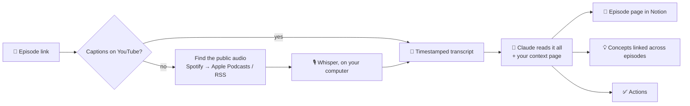

<p>
  <picture>
    <source media="(prefers-color-scheme: dark)" srcset="docs/images/cue-logo-reversed.svg">
    
  </picture>
</p>

# cue

**Podcasts and videos you actually remember — and what they mean for you.**

Paste a link to a podcast, a YouTube video, a talk or a lecture. Get what it says, what it means for *you*, and what to do next, in your Notion. *(Cue is pronounced like the letter Q.)*

[🇮🇹 Leggi in italiano](README.it.md)

You listen to great podcasts, watch great talks and lectures, and forget them a week later. Cue turns each one into a Notion page you'll actually use: the key ideas, chapters with clickable timestamps, the best quotes, and — the part that matters — **how it connects to your own projects and what you should do about it**.

It's a free plugin for the Claude app. No API keys, no subscriptions beyond your Claude plan, no code.

## See it in action

**[Browse the live demo →](https://app.notion.com/p/nikolaj1205/cue-demo-3e74ef8c88ab81df84e6fb5c93256e8b)** No install needed: two Y Combinator episodes processed by cue for an example founder who is building a scheduling app for restaurants.

<table>
  <tr>
    <td width="50%"><br><sub>In short and key ideas, with the episode's real numbers</sub></td>
    <td width="50%"><br><sub>What it means for me: tied to the founder's own questions</sub></td>
  </tr>
  <tr>
    <td width="50%"><br><sub>Chapters with clickable timestamps</sub></td>
    <td width="50%"><br><sub>A concept where two guests disagree</sub></td>
  </tr>
</table>

## Why the name

In audio, a **cue point** is the exact spot in a track you jump back to: every note Cue writes has one. In psychology, a **retrieval cue** is the hint that brings a memory back: that's the promise.

## What you get

For every episode, a page in Notion with:

- ⚡ **In short**: the core idea in 2-3 sentences
- 🧠 **Key ideas**: 5-8 points with the episode's real numbers and examples
- 📑 **Chapters**: with timestamps that jump straight to that minute
- 💬 **Quotes**: word for word, with the minute they were said
- 🧭 **What it means for me**: tied to *your* projects and goals, not generic advice
- 🔗 **Connections**: the concepts in the episode, and what other episodes you've processed say about them — who agrees, who disagrees
- ✅ **Actions**: concrete next steps (a book to read, a tool to try, an idea for your project), collected in one to-do list

Over time you build a **brain**: a library of concepts that link episodes together, so "network effects" or "pricing" shows everything every guest said about it.

Summaries are written in the language you choose. Quotes stay in the original.

## What you need

- The **Claude desktop app** (Windows or Mac) with a Claude **Pro or Max** plan
- A **Notion** account, connected to Claude (Settings → Connectors → Notion)
- About 5 minutes

## Install

In the Claude desktop app, open the **Code** tab and start a session in any folder (for example *Documents*). Then:

1. Click **+** next to the message box → **Plugins** → **Add plugin**.
2. Choose **Add marketplace** and paste:
   ```
   https://github.com/NikolajSaudella/cue
   ```
3. Select **cue** in the list and choose **Install for you**, so it works in every folder.

<details>
<summary>Using Claude Code in the terminal instead?</summary>

```
/plugin marketplace add NikolajSaudella/cue
/plugin install cue@cue
```
</details>

Then start a new chat and write:

```
Set up Cue
```

Claude takes it from there. It will:

1. **Ask you 4 quick questions**: who you are, what you're building, your goals, the topics you care about. This is what makes the notes personal.
2. **Create your cue space in Notion**: a home page, your context page, and the Episodes, Concepts and Actions databases.
3. **Install the transcription tools** on your computer. You just approve; no terminal needed.
4. **Process your first episode** with you.

## Everyday use

- **Paste a link** in Claude: a podcast (Spotify, Apple Podcasts), any YouTube video (interviews, talks, lectures, webinars) or a link to an audio file. For example: `https://www.youtube.com/watch?v=...`
- **From your phone**: add a row with the link to the **📥 Inbox** in Notion, then tell Claude "process my inbox".
- **Keep "🧭 My context" up to date**: new project, new goal? Edit the page, and future episodes will take it into account.

How long it takes:
- **YouTube episodes with captions:** a couple of minutes.
- **Episodes that need transcribing** (Spotify, Apple Podcasts, YouTube without captions): roughly 30-45 minutes per hour of audio on a typical laptop, faster on recent computers. It runs in the background: you can keep working, but keep the computer on.

## How it works



- **Transcription happens on your computer**:
  - YouTube captions when available;
  - otherwise the free, open-source [Whisper](https://github.com/openai/whisper) speech-to-text model (via [faster-whisper](https://github.com/SYSTRAN/faster-whisper)).
- **Spotify episodes** are matched to the same public episode on Apple Podcasts or its RSS feed. Spotify exclusives can't be transcribed: use the YouTube link if there is one.
- **Claude** (in your own app, on your own plan) writes the notes and talks to Notion through the official Notion connector.

More detail for the curious: [docs/how-it-works.md](docs/how-it-works.md).

## Privacy

- Audio and transcripts stay **on your computer**.
- Your notes go only to **your** Notion, through the connector you authorised.
- Cue has no server, no account, no analytics.

## FAQ

**Does it cost anything?**
No. It uses your existing Claude plan and free, open-source tools.

**Does my computer need to stay on?**
Yes, while an episode is being processed, since transcription runs locally.

**Can I use it in Italian, Spanish…?**
Yes. You choose the language during setup. The episode can be in any language Whisper understands.

**Can I change the Notion layout?**
Add views, move pages, add your own properties: all fine. Don't rename the existing properties or their options: Cue uses those names.

**Something went wrong.**
Tell Claude what happened in your own words. The row in Notion also shows the error in plain language.

## Roadmap

- 📡 **Subscriptions**: follow a podcast or YouTube channel and new episodes arrive by themselves
- 📬 **Weekly digest**: every Sunday, the ideas that kept coming back and 3 actions for the week
- ⏰ **Automations**: process the inbox on a schedule

Ideas and bug reports are welcome in [Issues](../../issues).

## Credits

Built by [Nikolaj Saudella](https://www.linkedin.com/in/nikolajsaudella/): I was the product owner, [Claude Code](https://claude.com/claude-code) was the engineer.
Transcription by [yt-dlp](https://github.com/yt-dlp/yt-dlp), [youtube-transcript-api](https://github.com/jdepoix/youtube-transcript-api) and [faster-whisper](https://github.com/SYSTRAN/faster-whisper). Python and dependencies are installed by [uv](https://github.com/astral-sh/uv).

MIT License.
