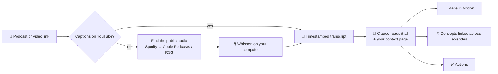

# How Cue works

Cue is a [Claude Code plugin](https://code.claude.com/docs/en/plugins): two skills (instructions Claude follows) plus a small Python transcription engine. Claude is the "brain"; Notion is where the notes live; the user's computer does the transcription.



## What a page contains

- ⚡ **In short**: the core idea in 2-3 sentences
- 🧠 **Key ideas**: 5-8 points with the real numbers and examples
- 📑 **Chapters**: timestamps that jump straight to that minute
- 💬 **Quotes**: word for word, with the minute they were said
- 🧭 **What it means for me**: tied to the projects and goals in "🧭 My context"
- 🔗 **Connections**: the concepts in the episode and what other episodes say about them (confirms / adds / disagrees)
- ✅ **Actions**, 📚 resources mentioned, ❓ questions to reflect on

Concepts live in their own database, so opening "pricing" or "network effects" shows everything every guest said about it.

## More questions

**What happens to my old notes when I change my context?** New episodes use the new context right away. Past episodes keep what was written for your old context until you say **"refresh my notes"**: cue then rewrites only the personal parts ("What it means for me", "Questions to reflect on", the concepts' "For me") for the episodes you choose (the last 10, all, a topic, or one), adds at most 2 new actions per episode, and keeps the previous version in a toggle on each page. What the episode says (summary, key ideas, chapters, quotes, connections) never changes. Each episode's `notion.json` records which version of the context it was written for (`context_edited_at`), and cue mentions it when your context has changed since the last run.

**How long does it take?** YouTube videos with captions: the transcript takes seconds, the whole page a few minutes (Claude reading and writing). Audio that needs transcribing (Spotify, Apple Podcasts, YouTube without captions): about 15-25 minutes per hour of audio on a recent laptop, in the background. Measured on a 2023 mid-range laptop (Intel Core i5-13420H, 16 GB): an 84-minute English episode in 20 minutes, a 40-minute Italian one in 14 minutes plus about a minute to download 96 MB of audio. It depends mostly on the processor and on what else the computer is doing: a video call or a video export can make it two or three times slower. The computer must stay on. The first time also downloads a ~500 MB speech model. While it runs, the Progress column shows the percentage and the minutes left, measured live.

**Which sources work?** Spotify and Apple Podcasts episodes, any YouTube video (interviews, talks, lectures, webinars) and direct links to audio files. Spotify episodes are matched to the same public episode on Apple Podcasts or its RSS feed; Spotify exclusives can't be transcribed, so use the YouTube link if there is one.

**Which languages?** Notes are written in the language chosen during setup; quotes stay in the original. The episode can be in any language Whisper understands.

**Privacy?** Audio (deleted once transcribed), transcripts and `segments.json` are saved only on your computer, in cue's data folder. To write the notes, Claude reads the transcript in your own Claude app, like any text you send it, under your plan's terms. Notion receives the notes through the connector you authorised, never the full transcript. Cue has no server, no account, no analytics. Downloads are limited to public web addresses (every redirect is checked; local and private network addresses are refused), capped at ~1.5 GB, and only start if there's enough free disk space. Logs never contain a link's query string, where private feeds keep their access tokens.

**Can I change the Notion layout?** Add views, move pages, add your own properties: all fine. Don't rename the existing properties or their options: Cue uses those names.

**Something went wrong.** Tell Claude what happened in your own words. The row in Notion also shows the error in plain language.

**Credits.** Transcription by [yt-dlp](https://github.com/yt-dlp/yt-dlp), [youtube-transcript-api](https://github.com/jdepoix/youtube-transcript-api) and [faster-whisper](https://github.com/SYSTRAN/faster-whisper) (OpenAI's [Whisper](https://github.com/openai/whisper) model). Python and dependencies are installed by [uv](https://github.com/astral-sh/uv).

## Pieces

| Path | What it does |
|---|---|
| `.claude-plugin/plugin.json` | Plugin manifest |
| `.claude-plugin/marketplace.json` | Lets people install the plugin straight from this repository |
| `skills/setup/SKILL.md` | First run: interview, Notion space, tool installation, first episode |
| `skills/episode/SKILL.md` | Turns one episode (or the Notion inbox) into a page, concepts and actions |
| `skills/refresh/SKILL.md` | After the user changes "🧭 My context": rewrites the personal parts of past episodes |
| `scripts/transcribe.py` | Entry point. Idempotent: starts the work in the background and can be re-run until it's done |
| `scripts/fetch_transcript.py` | Finds the episode and produces a timestamped transcript |
| `tests/` | Unit tests for the scripts (no network needed): `uv run --with pytest --with requests pytest tests` |

## Transcription pipeline

1. **YouTube**: captions via `youtube-transcript-api` (fallback: `yt-dlp`). No captions → download the audio with `yt-dlp` and transcribe it with Whisper.
2. **Spotify**:
   - the episode page is read like a link preview, to get the title and show;
   - the same public episode is found in the Apple Podcasts index (iTunes Search API) or in the show's RSS feed;
   - last resort: a YouTube search for the same episode.
3. **Apple Podcasts**: iTunes Lookup API, with the RSS feed as a fallback for older episodes.
4. **Audio file link**: downloaded and transcribed.

Whisper runs locally with `faster-whisper` (model `small`, int8, CPU, voice-activity filter). The output is a text file in ~45-second blocks, each starting with `[mm:ss]`: that's what makes clickable chapter timestamps possible.

Long transcriptions run in a detached process. `transcribe.py` waits up to 150 seconds per call and returns exit code 2 with a progress line if it's still running. Claude re-runs the same command, and the transcription never starts over.

**Errors** come back as `{"ok": false, "error", "code", "message", "retry_with_update"}`: `code` is stable (`youtube_bot_check`, `age_restricted`, `private`, `members_only`, `live`, `unavailable`, `rate_limited`, `spotify_exclusive`, `unsupported`, `offline`, `no_disk_space`, `whisper_model`, `youtube_changed`, `unknown`) and `message` is plain English that Claude translates. When `retry_with_update` is true, the skill runs the same command once more with `uv run --upgrade-package yt-dlp --script …`, which fixes most breakages caused by YouTube changes.

**Update notice:** at the end of each episode (and in `--check`), `transcribe.py` compares its version with `.claude-plugin/plugin.json` on the `main` branch of this repository, at most twice a day and with a 4-second timeout, and adds `cue_update` to its JSON when a newer version exists. The skill then tells the user once how to update.

## Dependencies

`transcribe.py` declares its dependencies inline ([PEP 723](https://peps.python.org/pep-0723/)). `uv run --script` creates a cached environment with the right Python and packages the first time, so users never install Python themselves. `deno` (from PyPI) is included as the JavaScript runtime `yt-dlp` needs for YouTube.

## Data on the user's computer

Everything lives in the plugin's data folder (`~/.claude/plugins/data/cue-…/`), which survives plugin updates:

| File | Content |
|---|---|
| `config.json` | Language, uv command, IDs of the user's Notion pages, databases and views |
| `episodes/<source>-<id>/` | `meta.json`, `transcript.txt`, `notion.json` (link to the finished page) |
| `models/` | The Whisper model, downloaded on first use (~500 MB) |
| `.env` *(optional)* | `NOTION_TOKEN=` of a Notion integration, for live progress during long transcriptions |

## Notion structure

Created by the setup skill:

- a **home page** with the cue logo and cover (`docs/images/notion-icon.png`, `docs/images/notion-cover.png`), a short guide, and the 📥 Inbox and 📚 Library as linked views;
- **🧭 My context**;
- three databases:
  - **Episodes**, with the views 📥 Inbox and 📚 Library;
  - **Concepts**, with a two-way relation to Episodes;
  - **Actions**, with a two-way relation to Episodes and the view "To do".

Property names and select options are in English because the skills rely on them. The content is written in the user's language.

Databases are read through views (the connector's "view mode"). That mode has no quota on any Notion plan, unlike SQL queries.

## Running the engine by hand

```
uv run --script scripts/transcribe.py --check --data ~/.cue
uv run --script scripts/transcribe.py "https://www.youtube.com/watch?v=..." --data ~/.cue
uv run --script scripts/transcribe.py --suggest "how to price a b2b saas" --data ~/.cue
```

`--suggest` searches YouTube for up to 3 videos of 7-30 minutes, most with captions (so they are ready in about 2 minutes): the setup uses it to pick a first episode about the user's own question.

## Releasing an update

Claude Code decides whether an installed plugin needs updating by comparing the `version` in `.claude-plugin/plugin.json`. **Every change meant for users needs a new version number**, otherwise people who already installed cue never receive it:

1. Bump `version` in `.claude-plugin/plugin.json` (e.g. `0.1.0` → `0.1.1` for fixes, `0.2.0` for new features).
2. Add a section to `CHANGELOG.md`.
3. Commit, tag (`git tag -a v0.1.1 -m "..."`) and push with `--follow-tags`, then publish a GitHub release from the tag.

Auto-update is off by default for marketplaces outside Anthropic's own, so users update by hand:

- desktop app: **+** → **Plugins** → **Manage plugins** → cue → **Update**;
- terminal session: `/plugin` → **Installed** → cue → **Update now**;
- shell: `claude plugin marketplace update cue` then `claude plugin update cue@cue`.

Or they turn on auto-update once: `/plugin` → **Marketplaces** → cue → **Enable auto-update**.

## Uninstalling

**+** → **Plugins** → **Manage plugins** → cue → **Uninstall** in the desktop app, or `claude plugin uninstall cue@cue` in a shell. Uninstalling also deletes the data folder (config, transcripts, Whisper model) unless `--keep-data` is passed. The Notion pages stay. uv and its package cache stay too, since other tools may use them: `uv cache clean` frees that space.

## Permissions

The skills pre-approve (for their own turn only) just what cue needs: checking `uv --version`, running `uv run --script …/scripts/transcribe.py` (also with `--upgrade-package yt-dlp`), reading cue's data folder and writing its `config.json` and each episode's `notion.json`. The rules are anchored on the command, in the three forms the skills use for uv: `uv`, `~/.local/bin/uv` (Bash) and `& "$HOME\.local\bin\uv.exe"` (PowerShell). Anything else asks the user. Transcripts, titles and descriptions are treated as content, never as instructions.

## Automatic checks

`.github/workflows/check.yml` runs on every push: manifests are valid JSON, the scripts compile, the unit tests in `tests/` pass, the version has a `CHANGELOG.md` section (and matches the tag on a release), plugin files never change without a new version, and `claude plugin validate` passes.
